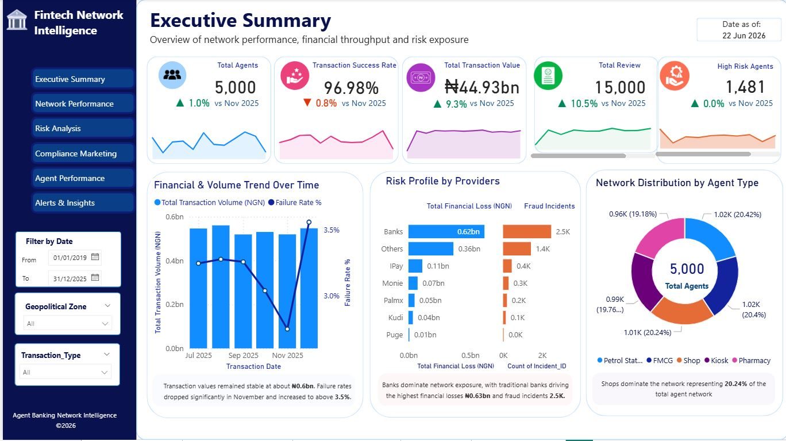
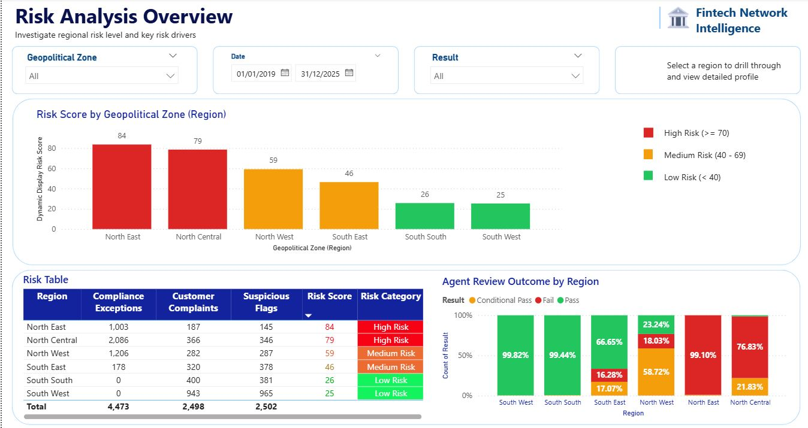
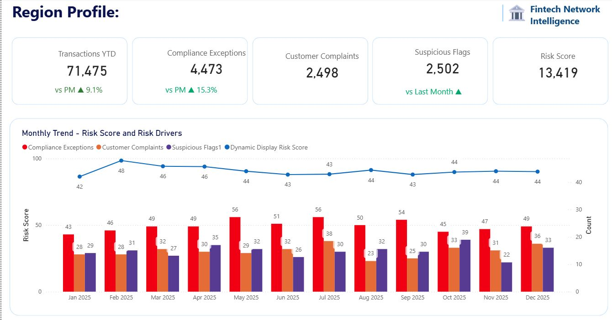
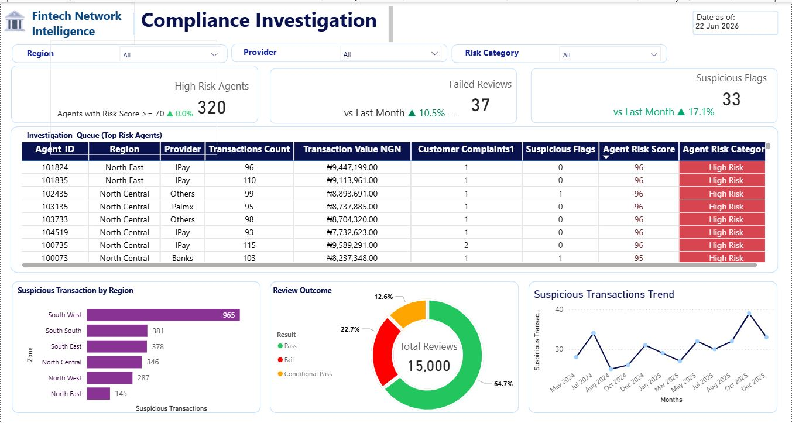
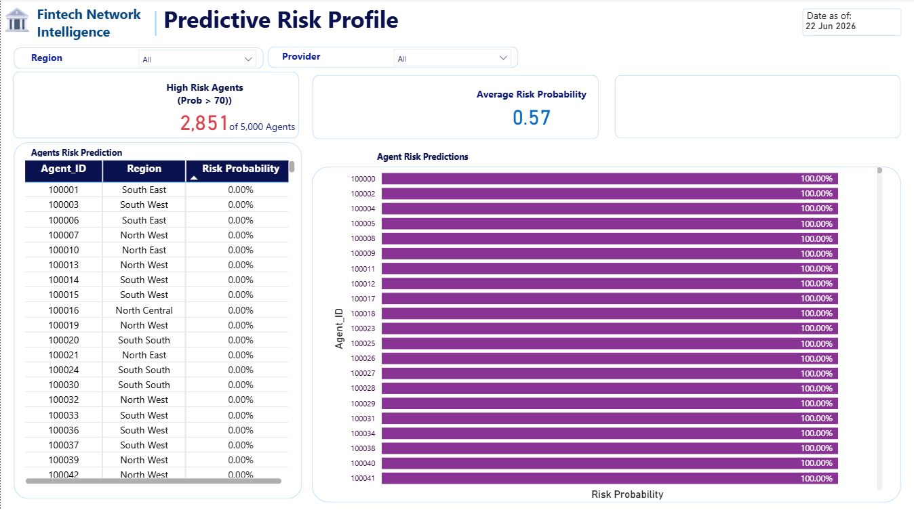

# Agent Banking Compliance & Risk Intelligence Framework

A comprehensive, end-to-end data engineering and analytics framework engineered to detect, monitor, and mitigate compliance and fraud risk within a large-scale agent banking network. This system processes over 500,000 transactions across 5,000 active agents to identify regional risk hotspots, suspicious provider concentrations, and prioritize field investigations.
---

## 💼 Project Case Study

### 📌 Situation
In large scale agent banking and fintech networks, compliance teams manually tracking fraud and operational irregularities face massive scalability bottlenecks. This project simulates a rapidly expanding financial ecosystem processing over 500,000 transactions across 5,000 active field agents. Without automation, identifying regional risk hotspots, tracking volatile service provider failure rates, and catching bad actors happens reactively often after significant capital or reputational damage has occurred.

### 🎯 Task
My objective was to design, develop, and deploy an end-to-end data intelligence and risk-scoring framework. The system needed to automatically ingest raw operational data, enforce strict relational data integrity rules, run predictive compliance algorithms, and surface actionable, real-time priorities directly to field auditors and C-suite risk executives.

### ⚙️ Action
I engineered a modular data pipeline split into three distinct core architectural layers:
* **Data Engineering (Python):** Architected a 7-stage data processing pipeline (`01_generate_data` through `07_predictive_risk_model`). It handles robust data generation with regional statistical skews, structural cleaning, automated missing-value logic, and error handling.
* **Database Optimization (SQL):** Enforced database normalization principles by creating a production grade relational database schema (`schema.sql`). Structured precise primary/foreign key relationships across transactional facts and agent dimensions, writing specialized analytical queries to pinpoint provider specific failure anomalies.
* **Predictive Risk Scoring (Machine Learning):** Deployed a deterministic and predictive risk-modeling script. The algorithm evaluates weighted operational features such as documentation quality scores, historic fraud flags, and consumer incident volumes to calculate an active risk score. It automatically flags high-risk agents tracking a compliance probability score $\ge$ 70.

### 📊 Result
* **Automated Architecture:** Delivered a completely functional, reproducible terminal driven data pipeline that seamlessly transforms raw transactional activity into structured database metrics.
* **Executive Decision Suite:** Designed a comprehensive 5-page interactive Power BI workspace. The solution maps macro performance vectors, displays deep-dive geopolitical risk profiling across regional zones, and aggregates predictive flags into a prioritized field-investigation queue.
* **Business Value:** This system eliminates manual auditing overhead by instantly transforming messy backend transaction data into highly targeted, evidence-based field intervention plans.

---

## 🎛️ Data Generation & Architecture Disclosure

> 🔒 **Data Privacy & Governance Note:** To maintain strict institutional data compliance and protect enterprise operational privacy, all data utilized in this framework was **programmatically engineered from scratch** using Python. 

Rather than utilizing a static, pre-cleaned public dataset, I built a custom simulation engine to mimic a real-world enterprise environment. This allowed me to intentionally bake in complex data engineering challenges, including:
* **Relational Integrity:** Programmatically generating synchronous primary and foreign key constraints across `dim_agents`, `dim_locations`, and `fact_transactions`.
* **Realistic Business Skews:** Injecting intentional statistical anomalies, regional risk concentrations, and fluctuating provider failure rates into the data to test the pipeline's compliance filters.
* **Messy Data Simulation:** Simulating operational realties like missing values, documentation quality deficits, and customer dispute flags to thoroughly test the Python cleaning modules.

This approach demonstrates complete ownership of the data lifecycle from initial schema design and synthetic simulation to database loading, predictive modeling, and final BI visualization.

---
## 📁 Repository Architecture
* **`scripts/`**: Core data engineering, Relational data simulation, automated processing, and predictive scoring pipelines.
* **`sql/`**: Relational database schemas, staging logic, and deep analytical compliance queries.
* **`AgentBankingDB.pbix`**: Interactive executive Power BI application file mapping operational and geopolitical threat parameters.

---

## 🛠️ Data Engineering & Pipeline Breakdown

The project operates as a structured 7-stage data generation, cleaning, and modeling pipeline:

1. **`01_generate_data.py`**: Generates a synthetic multi-table relational schema containing transaction, customer, agent, incident, and compliance review facts. Uses consistent random states to enforce regional statistical skews (e.g., higher exception concentrations in specific geopolitical zones).
2. **`02_clean_data.py`**: Automated data cleaning pipeline handling missing values, standardizing datetime fields, tracking data integrity rules, and preparing tables for database insertion.
3. **`03_risk_scoring.py` & `07_predictive_risk_model.py`**: Implements deterministic and predictive compliance scoring algorithms. Identifies high-risk agents (Probability score $\ge$ 70) by analyzing weighted patterns of documentation quality, historic fraud flags, and compliance review outcomes.
4. **`04_update_sql_db.py`**: Automated pipeline for structuring connection layouts, staging data frames, and refreshing the relational database tables.
5. **`05_analysis.py` & `06_quick_check.py`**: Diagnostic scripts providing high-level operational reporting, validation checks, and feature performance metrics.

---

## 💻 Relational Database Analytics (SQL)

The database structure relies on relational database management best practices, controlled via three core production scripts:
* **`schema.sql`**: Designs the physical storage layer, enforces primary/foreign key relationships, and standardizes dimensional schemas across tables (`Agents`, `Customers`, `Transactions`, `Reviews`, `Incidents`).
* **`load_data.sql`**: Handles optimized batch insertion and table loading routines.
* **`analysis_queries.sql`**: Deep forensic accounting and investigative analytics queries designed to surface transaction volume metrics, failure rates by individual service provider, and active compliance breaches.

---

## 📊 Business Intelligence & Executive Outcomes

The analytical scripts feed directly into a multi-layered **Power BI Dashboard** that empowers risk management teams to transition from reactive monitoring to evidence-based field intervention:

* **Executive Summary**: Tracks nationwide transactional volume (NGN), operational success rates, and dynamic risk tiers.
* **Geopolitical Risk Profiles**: Visualizes regional compliance hotspots, highlighting critical exception density shifts across regional zones.
* **Predictive Investigation Queue**: Aggregates high-probability fraud flags and customer complaints into a real-time, prioritized investigation action log for field auditors.

---

## 📊 Executive Dashboard Solutions

### Page 1: High-Level Macro Insights & Performance Vectors


### Page 2: Risk Profiling Overview


### Page 3: Geopolitical Risk Profiling & Regional Hotspots


### Page 4: Compliance Analysis


### Page 5: Predictive Risk Profiles & Active Investigation Queue


---

## 🚀 How to Run the Pipeline Local Environment

1. Clone this repository to your local directory.
2. Initialize your Python virtual environment and install dependencies:
   ```bash
   python -m venv venv
   source venv/bin/activate  # On Windows use: venv\Scripts\activate
   pip install -r requirements.txt
